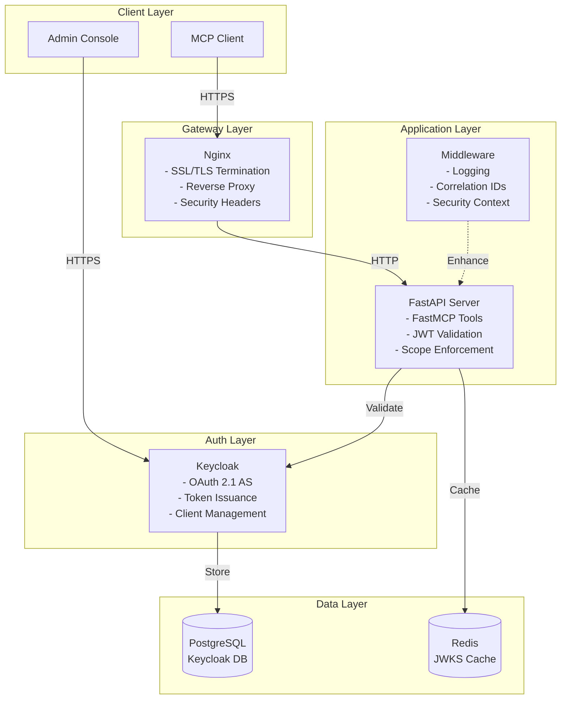
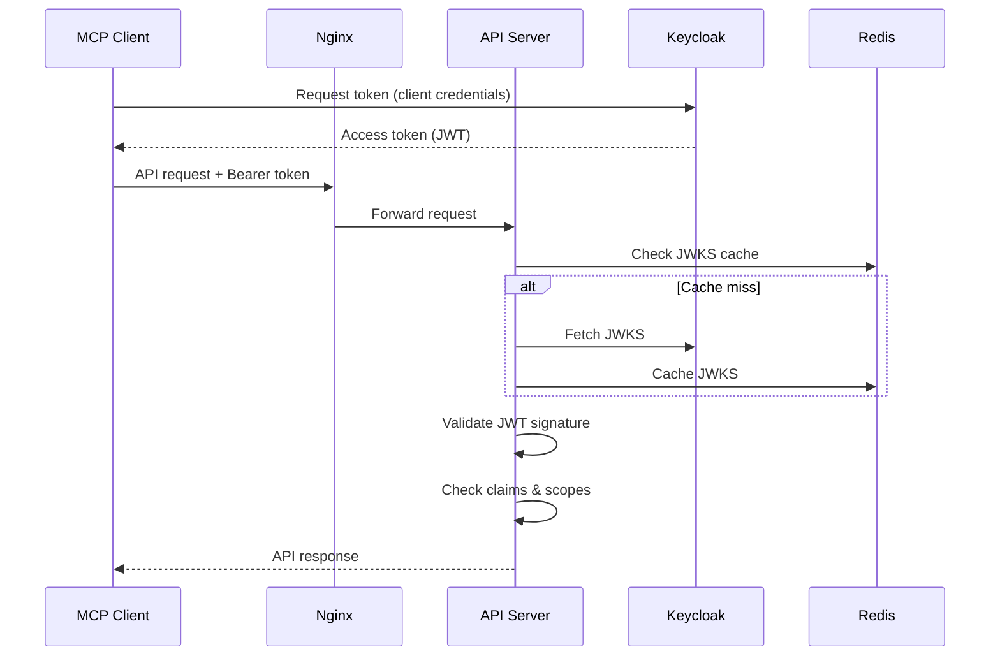

# demoSecureMCP

This is a WIP - trying to implement a basic secure MCP server (per the spec) along with some infrastructure, including Keycloak for IDP, to try out ideas. Use at your own risk.

There are some "production" aspects captured herein, but that is aspirational at this point in time.

A Python implementation of a Model Context Protocol (MCP) server built with **[FastMCP](https://github.com/fastmcp/fastmcp)** and FastAPI, featuring enterprise-grade OAuth 2.1 authentication, leveraging Keycloak for identity management and Docker for deployment.

## 🎯 Why This Project Exists

The Model Context Protocol (MCP) enables seamless integration between AI models and external tools/data sources. However, most MCP implementations lack proper security controls, making them unsuitable for enterprise use. This project addresses that gap by combining **FastMCP** (a Python framework for building MCP servers) with enterprise security features:

- **Enterprise Security**: OAuth 2.1/PKCE compliant authentication with JWT validation
- **Production Ready**: Docker-based deployment with nginx, health checks, and monitoring
- **Standards Compliant**: Implements RFC 9728 (Protected Resource Metadata) and OAuth 2.1 best practices
- **Extensible**: Easy to add new MCP tools while maintaining security
- **Well Tested**: Comprehensive test suite covering auth flows, token validation, and tool functionality

## 🏗️ Architecture Overview



## 🚀 Quick Start

### Prerequisites

- Docker & Docker Compose
- Python 3.11+ (for local development)
- 4GB RAM minimum
- Ports 80, 443, 8080 available

### 1. Clone and Setup

```bash
git clone https://github.com/phunt/demoSecureMCP.git
cd demoSecureMCP

# Copy environment template
cp .env.example .env

# Edit .env with your settings
# IMPORTANT: Change all default passwords!
```

### 2. Start Services

```bash
# Start all services
./scripts/docker_manage.sh start

# Check health status
./scripts/docker_manage.sh health

# View logs
./scripts/docker_manage.sh logs
```

### 3. Configure Authentication

You can use either Dynamic Client Registration (recommended) or static credentials:

#### Option A: Dynamic Client Registration (Recommended)

```bash
# Generate and configure DCR
./scripts/setup_dcr.sh --auto-update

# Restart MCP server to apply
docker compose restart mcp-server
```

#### Option B: Static Credentials

```bash
# Edit .env.docker with static credentials
# KEYCLOAK_CLIENT_ID=mcp-server
# KEYCLOAK_CLIENT_SECRET=your-secret
```

### 4. Test the Setup

1. Access Keycloak at http://localhost:8080
2. Login with admin/admin_password (change immediately!)
3. The MCP realm is auto-imported with:
   - Client: `mcp-server` (confidential)
   - Scopes: `mcp:read`, `mcp:write`, `mcp:infer`

### 5. Test the API

```bash
# Get an access token
TOKEN=$(curl -s -X POST http://localhost:8080/realms/mcp-realm/protocol/openid-connect/token \
  -H "Content-Type: application/x-www-form-urlencoded" \
  -d "grant_type=client_credentials" \
  -d "client_id=mcp-server" \
  -d "client_secret=your-secret" \
  -d "scope=mcp:read mcp:write" | jq -r '.access_token')

# Test protected endpoint
curl -H "Authorization: Bearer $TOKEN" https://localhost/api/v1/me --insecure

# List available tools
curl -H "Authorization: Bearer $TOKEN" https://localhost/api/v1/tools --insecure

# Use a tool
curl -X POST https://localhost/api/v1/tools/echo \
  -H "Authorization: Bearer $TOKEN" \
  -H "Content-Type: application/json" \
  -d '{"message": "Hello, Secure MCP!"}' \
  --insecure
```

### 5. Use the Example Curl Client

For a complete example of OAuth authentication and tool usage, see the curl-based client:

```bash
cd examples/curl-client

# Run the full demo
./full_example.sh

# Or use individual scripts
./get_token.sh                    # Get access token
./call_tool.sh echo "Hello!"      # Call tools
./test.sh                         # Run test suite
```

See [examples/curl-client/README.md](examples/curl-client/README.md) for detailed documentation.

## 📁 Project Structure

```
demoSecureMCP/
├── src/                    # Application source code
│   ├── app/               # FastAPI application
│   │   ├── auth/         # Authentication & authorization
│   │   ├── tools/        # FastMCP tool implementations
│   │   └── main.py       # Application entry point
│   ├── config/           # Configuration management
│   └── core/             # Core utilities & middleware
├── examples/              # Example implementations
│   └── curl-client/      # Shell-based client using curl
├── tests/                 # Test suites
├── keycloak/             # Keycloak configuration
├── nginx/                # Nginx reverse proxy config
├── docs/                 # Additional documentation
└── docker-compose.yml    # Service orchestration
```

## 🔐 Security Model

### Authentication Flow



### Security Features

- **OAuth 2.1 Compliance**: Latest security standards including PKCE
- **JWT Validation**: Signature verification with JWKS rotation support
- **Scope-Based Authorization**: Fine-grained access control
- **Dynamic Client Registration**: No hardcoded credentials, clients register dynamically
- **Security Headers**: HSTS, CSP, X-Frame-Options via Nginx
- **Structured Logging**: Security events with correlation IDs
- **No Hardcoded Secrets**: Environment-based configuration

## 🛠️ Development

### Local Development Setup

```bash
# Create virtual environment
python -m venv .venv
source .venv/bin/activate  # or `.venv\Scripts\activate` on Windows

# Install dependencies
pip install -r requirements.txt
pip install -r requirements-dev.txt

# Run tests
python tests/run_all_tests.py
```

### Adding New MCP Tools with FastMCP

FastMCP makes it easy to create secure MCP tools. Here's how:

1. Create tool module in `src/app/tools/`
2. Define request/response models with Pydantic
3. Implement tool logic using FastMCP's Context
4. Register endpoint in `src/app/main.py`
5. Add scope requirements
6. Update tool discovery endpoint
7. Add tests

Example using **FastMCP**:
```python
# src/app/tools/my_tool.py
from pydantic import BaseModel
from fastmcp import Context  # FastMCP provides context for logging

class MyToolRequest(BaseModel):
    input_data: str

class MyToolResponse(BaseModel):
    result: str

async def my_tool(request: MyToolRequest, ctx: Context) -> MyToolResponse:
    # Tool implementation
    return MyToolResponse(result="processed")
```

## 📊 Monitoring & Operations

### Health Checks

- **API Health**: `GET /health`
- **Keycloak Ready**: Via admin API
- **Service Status**: `./scripts/docker_manage.sh health`

### Logs

- **Structured JSON logs**: Application events
- **Security audit logs**: Auth attempts, access decisions
- **Correlation IDs**: Request tracking
- **Log aggregation ready**: Works with ELK/Splunk

### Metrics

- Request duration
- Token validation performance
- Tool usage statistics
- Error rates by endpoint

## 🚢 Production Deployment

### Using Docker Compose

```bash
# Deploy with production settings
docker compose -f docker-compose.yml -f docker-compose.prod.yml up -d

# With Docker Swarm secrets
docker secret create keycloak_client_secret ./secrets/client_secret.txt
docker stack deploy -c docker-compose.yml -c docker-compose.prod.yml mcp-stack
```

### Kubernetes

See `k8s/` directory for Kubernetes manifests (if available).

### Environment Variables

Key variables (see `docs/ENVIRONMENT.md` for full list):
- `KEYCLOAK_URL`: Keycloak base URL
- `OAUTH_ISSUER`: Expected token issuer
- `MCP_RESOURCE_IDENTIFIER`: Your API identifier
- `REDIS_URL`: Redis connection string
- `LOG_LEVEL`: Logging verbosity

## 🧪 Testing

```bash
# Run all tests
python tests/run_all_tests.py

# Run specific test suite
python tests/test_client_credentials.py
python tests/test_token_validation.py
python tests/test_mcp_tools_integration.py
```

Test coverage includes:
- OAuth 2.0 client credentials flow
- JWT token validation scenarios
- Scope-based authorization
- MCP tool functionality
- Error handling

## 📚 Documentation

- [Environment Variables](docs/ENVIRONMENT.md) - Configuration reference
- [Docker Setup](docs/DOCKER.md) - Container orchestration details
- [Testing Guide](docs/TESTING.md) - Test suite documentation
- [API Reference](https://localhost/docs) - OpenAPI documentation

## 🤝 Contributing

1. Fork the repository
2. Create a feature branch
3. Add tests for new functionality
4. Ensure all tests pass
5. Submit a pull request

## 📄 License

[Your License Here]

## 🙏 Acknowledgments

- **MCP Framework**: [FastMCP](https://github.com/fastmcp/fastmcp) - The Python framework for building MCP servers
- **Web Framework**: [FastAPI](https://fastapi.tiangolo.com/) - Modern, fast web framework for building APIs
- **Authentication**: [Keycloak](https://www.keycloak.org/) - Open source identity and access management 