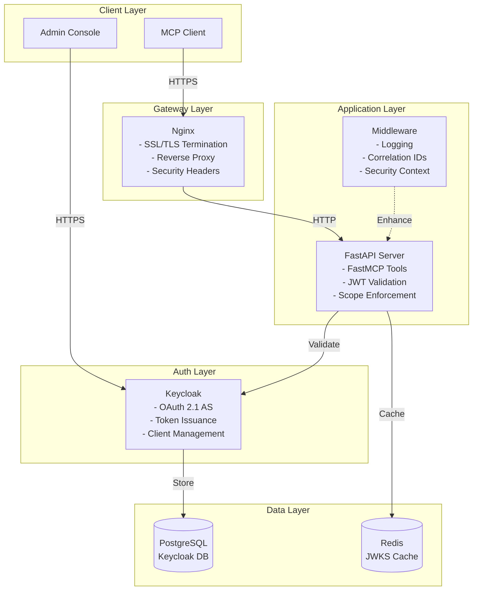

# demoSecureMCP

This is a WIP - trying to implement a basic secure MCP server (per the spec) along with some infrastructure, including Keycloak for IDP, to try out ideas. Use at your own risk.

There are some "production" aspects captured herein, but that is aspirational at this point in time.

A Python implementation of a Model Context Protocol (MCP) server built with **[FastMCP](https://github.com/fastmcp/fastmcp)** and FastAPI, featuring enterprise-grade OAuth 2.1 authentication, leveraging Keycloak for identity management and Docker for deployment.

## 🎯 Why This Project Exists

The Model Context Protocol (MCP) enables seamless integration between AI models and external tools/data sources. However, most MCP implementations lack proper security controls, making them unsuitable for enterprise use. This project addresses that gap by combining **FastMCP** (a Python framework for building MCP servers) with enterprise security features:

- **Enterprise Security**: OAuth 2.1/PKCE compliant authentication with JWT validation
- **Production Ready**: Docker-based deployment with nginx, health checks, and monitoring
- **Standards Compliant**: Implements RFC 9728 (Protected Resource Metadata) and OAuth 2.1 best practices
- **Extensible**: Easy to add new MCP tools while maintaining security
- **Well Tested**: Comprehensive test suite covering auth flows, token validation, and tool functionality

## 🌟 Key Features

### Security & Authentication
- **OAuth 2.1 Compliant**: Full OAuth 2.1 implementation with PKCE support via Keycloak
- **JWT Validation**: Robust token validation with JWKS caching using Redis
- **Scope-based Authorization**: Fine-grained access control with MCP-specific scopes
- **Dynamic Client Registration**: Support for RFC 7591 DCR through Keycloak

### Context-Aware URL Management
- **Automatic Context Detection**: Application automatically detects whether it's running in a container or on the host
- **Smart URL Selection**: No more hardcoded localhost vs container hostname confusion
- **Three-tier URL System**:
  - `EXTERNAL_*` URLs for host machine access
  - `INTERNAL_*` URLs for container-to-container communication
  - `PUBLIC_*` URLs for production deployment
- **Zero Configuration**: Works out of the box in both Docker and local development

### MCP Implementation
- **FastMCP Framework**: Built on FastMCP for rapid MCP tool development
- **Demo Tools**: Echo, timestamp, and calculator tools demonstrating different access patterns
- **Tool Discovery**: Automatic tool listing with required scopes
- **Protected Resource Metadata**: RFC 9728 compliant metadata endpoint

### Production Features
- **Health Checks**: Comprehensive health monitoring for all services
- **Structured Logging**: JSON logging with correlation IDs and security context
- **SSL/TLS**: Full HTTPS support with nginx reverse proxy
- **Docker Deployment**: Production-ready Docker Compose configuration
- **Secrets Management**: Support for Docker secrets and environment-based configuration

## 🏗️ Architecture Overview



## 🚀 Quick Start

### Prerequisites

- Docker & Docker Compose
- Python 3.11+ (for local development)
- 4GB RAM minimum
- Ports 80, 443, 8080 available

### 1. Clone and Setup

```bash
git clone https://github.com/phunt/demoSecureMCP.git
cd demoSecureMCP

# Copy environment template
cp docs/ENV_TEMPLATE.md .env

# Edit .env with your settings
# IMPORTANT: Change all default passwords!
```

### 2. Start Services

```bash
# Start all services
./scripts/docker_manage.sh start

# Or use docker-compose directly
docker compose up -d
```

### 3. Configure Authentication

The system supports two authentication modes:

#### Option A: Dynamic Client Registration (DCR)

```bash
# Generate initial access token for DCR
./scripts/setup_dcr.sh

# The script will update your configuration automatically
# Restart MCP server to apply
docker compose restart mcp-server
```

#### Option B: Static Credentials

```bash
# Edit .env with static credentials
# KEYCLOAK_CLIENT_ID=mcp-server
# KEYCLOAK_CLIENT_SECRET=your-secret
```

### 4. Test the Setup

1. Access Keycloak at http://localhost:8080
2. Login with admin/admin_password (change immediately!)
3. The MCP realm is auto-imported with:
   - Client: `mcp-server` (confidential)
   - Scopes: `mcp:read`, `mcp:write`, `mcp:infer`

### 5. Test the API

```bash
# Get an access token
TOKEN=$(curl -s -X POST http://localhost:8080/realms/mcp-realm/protocol/openid-connect/token \
  -H "Content-Type: application/x-www-form-urlencoded" \
  -d "grant_type=client_credentials" \
  -d "client_id=mcp-server" \
  -d "client_secret=your-secret" \
  -d "scope=mcp:read mcp:write" | jq -r '.access_token')

# Test protected endpoint
curl -H "Authorization: Bearer $TOKEN" https://localhost/api/v1/me --insecure

# List available tools
curl -H "Authorization: Bearer $TOKEN" https://localhost/api/v1/tools --insecure

# Use a tool
curl -X POST https://localhost/api/v1/tools/echo \
  -H "Authorization: Bearer $TOKEN" \
  -H "Content-Type: application/json" \
  -d '{"message": "Hello, Secure MCP!"}' \
  --insecure
```

### 5. Use the Example Curl Client

For a complete example of OAuth authentication and tool usage, see the curl-based client:

```bash
cd examples/curl-client
./full_example.sh
```

See [examples/curl-client/README.md](examples/curl-client/README.md) for detailed documentation.

## 🔧 Development

### Local Development (Without Docker)

```bash
# Create virtual environment
python -m venv .venv
source .venv/bin/activate  # On Windows: .venv\Scripts\activate

# Install dependencies
pip install -r requirements-dev.txt

# Start services (Keycloak, Redis, PostgreSQL)
docker compose up keycloak redis postgres -d

# Run the application
uvicorn src.app.main:app --reload
```

### Environment Configuration

The application uses context-aware URL management that automatically selects the correct URLs based on whether it's running in a container or on the host. See [docs/ENVIRONMENT.md](docs/ENVIRONMENT.md) for details.

Key environment files:
- `.env` or `.env.local` - Local development
- Docker Compose uses environment variables directly
- `.env.prod` - Production deployment

### Running Tests

The project includes comprehensive test suites with detailed reporting capabilities.

### Test Reports

All test outputs are generated in the `test-results/` directory:

- **JUnit XML**: `test-results/junit.xml` - CI/CD compatible test results
- **HTML Report**: `test-results/report.html` - Detailed interactive test report  
- **Coverage HTML**: `test-results/coverage-html/index.html` - Code coverage report
- **Coverage XML**: `test-results/coverage.xml` - CI/CD compatible coverage data

### Running Tests

#### Option 1: Comprehensive Test Runner (Recommended)
```bash
# Run all tests with full reporting
python tests/run_all_tests.py

# Or use make
make test
```

#### Option 2: Direct pytest
```bash
# Setup test environment first
./scripts/setup_test_environment.sh

# Run pytest directly  
pytest tests/

# Or use make
make pytest
```

#### Option 3: Individual Test Files
```bash
# Run specific test file
pytest tests/test_token_validation.py -v
```

### Test Configuration

The test suite uses pytest with the following features:

- **Async Support**: Full async/await testing with pytest-asyncio
- **Coverage Reporting**: Code coverage analysis with pytest-cov
- **HTML Reports**: Interactive test and coverage reports  
- **JUnit XML**: CI/CD integration support
- **Timeout Protection**: 5-minute test timeout to prevent hangs

Configuration files:
- `pytest.ini` - Main pytest configuration
- `.coveragerc` - Coverage reporting settings

### Viewing Reports

After running tests:

```bash
# Open test reports automatically
make test-reports

# Or manually open in browser
open test-results/report.html                    # Test results
open test-results/coverage-html/index.html      # Coverage report
```

### Development Commands

```bash
# Set up development environment
make install-dev

# Run linting
make lint

# Format code  
make format

# Type checking
make type-check

# Clean test artifacts
make test-clean
```

## 📁 Project Structure

```
demoSecureMCP/
├── src/                    # Application source code
│   ├── app/               # FastAPI application
│   │   ├── auth/         # Authentication & authorization
│   │   ├── tools/        # MCP tool implementations
│   │   └── main.py       # Application entry point
│   ├── config/           # Configuration management
│   └── core/             # Core utilities (logging, middleware)
├── tests/                 # Test suite
├── keycloak/             # Keycloak configuration
├── nginx/                # Nginx configuration
├── scripts/              # Utility scripts
├── examples/             # Example clients
└── docs/                 # Documentation
```

## 🔐 Security Features

### Authentication & Authorization
- **OAuth 2.1 Compliance**: Implements latest OAuth 2.1 draft specifications
- **PKCE Required**: Proof Key for Code Exchange mandatory for all flows
- **JWT Validation**: Complete token validation including signature, expiry, audience
- **Scope Enforcement**: Fine-grained access control at the endpoint level

### Network Security
- **TLS/HTTPS**: All external communication encrypted
- **Security Headers**: HSTS, X-Frame-Options, CSP configured
- **CORS**: Configurable Cross-Origin Resource Sharing

### Operational Security
- **No Hardcoded Secrets**: All sensitive data in environment variables
- **Structured Logging**: Security events logged with context
- **Health Checks**: Monitoring endpoints for all services
- **Container Security**: Non-root users, minimal images

## 📚 Documentation

- [Environment Variables](docs/ENVIRONMENT.md) - Complete configuration reference
- [Docker Setup](docs/DOCKER.md) - Docker and Docker Compose details
- [Testing Guide](docs/TESTING.md) - How to run and write tests
- [DCR Setup](docs/DCR.md) - Dynamic Client Registration configuration
- [Hostname Management](docs/HOSTNAME_REFACTOR.md) - Context-aware URL system

## 🛠️ MCP Tools

The server includes three demo MCP tools:

1. **Echo Tool** (`mcp:read`)
   - Echoes back messages with metadata
   - Demonstrates basic read operations

2. **Timestamp Tool** (`mcp:read`)
   - Returns current timestamp in various formats
   - Shows how to handle tool parameters

3. **Calculator Tool** (`mcp:write`)
   - Performs arithmetic calculations
   - Requires write scope (demonstration of scope enforcement)

## 🚨 Troubleshooting

### Common Issues

1. **Port Conflicts**
   ```bash
   # Check if ports are in use
   lsof -i :80 -i :443 -i :8080
   ```

2. **Docker Issues**
   ```bash
   # Clean restart
   ./scripts/docker_manage.sh clean
   ./scripts/docker_manage.sh start
   ```

3. **Authentication Failures**
   - Check OAuth issuer URL matches token issuer
   - Verify client credentials are correct
   - Ensure scopes are properly requested

4. **SSL Certificate Issues**
   ```bash
   # Regenerate self-signed certificates
   ./scripts/generate_ssl_certs.sh
   ```

## 🤝 Contributing

Contributions are welcome! Please:

1. Fork the repository
2. Create a feature branch
3. Make your changes with tests
4. Submit a pull request

## 📜 License

This project is licensed under the MIT License - see the LICENSE file for details.

## 🙏 Acknowledgments

- [FastMCP](https://github.com/fastmcp/fastmcp) - The MCP framework this project is built on
- [Keycloak](https://www.keycloak.org/) - Enterprise identity and access management
- [FastAPI](https://fastapi.tiangolo.com/) - Modern Python web framework

## 📮 Contact

For questions or support, please open an issue on GitHub. 