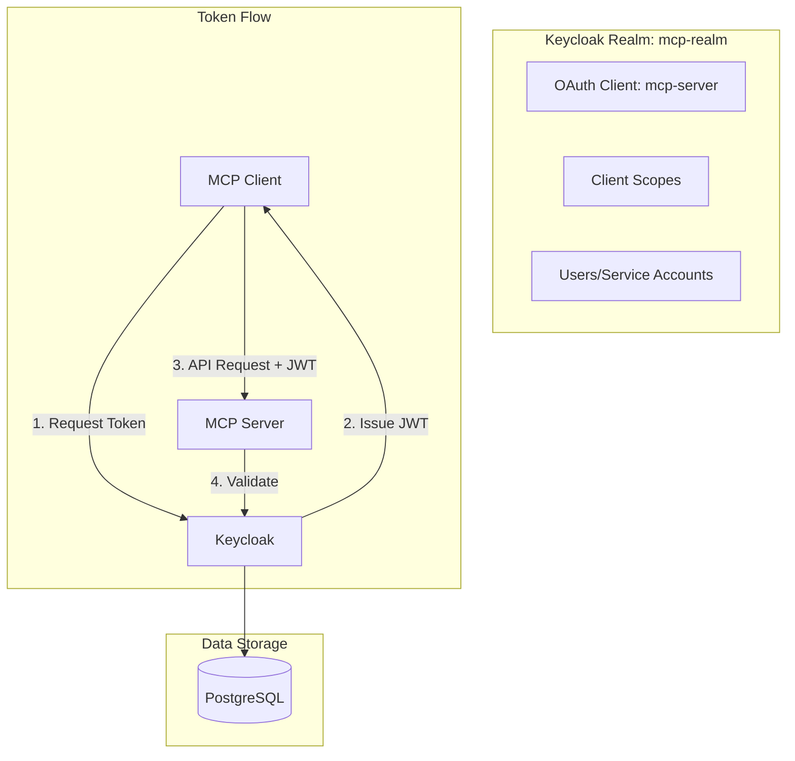

# Keycloak Configuration

This directory contains the Keycloak configuration for the Secure MCP Server, providing OAuth 2.1 compliant authentication and authorization.

## What is Keycloak?

Keycloak is an open-source Identity and Access Management (IAM) solution that provides:
- **OAuth 2.1/OIDC**: Standards-compliant authorization server
- **User Management**: Registration, login, profile management
- **Client Management**: OAuth clients with various grant types
- **Token Management**: JWT issuance, validation, and revocation
- **Realm Isolation**: Multi-tenant support

## Architecture in This Project



## Realm Configuration

The `realm-export.json` file contains the complete realm configuration:

### Realm: `mcp-realm`

Key settings:
- **Name**: `mcp-realm`
- **Access Token Lifespan**: 300 seconds (5 minutes)
- **Refresh Token Lifespan**: 1800 seconds (30 minutes)
- **Client Token Lifespan**: 300 seconds
- **Login Theme**: keycloak (customizable)

### Client: `mcp-server`

OAuth 2.0 client configuration:
```json
{
    "clientId": "mcp-server",
    "enabled": true,
    "clientAuthenticatorType": "client-secret",
    "secret": "your-secret-here",
    "standardFlowEnabled": false,
    "implicitFlowEnabled": false,
    "directAccessGrantsEnabled": false,
    "serviceAccountsEnabled": true,
    "authorizationServicesEnabled": false,
    "protocol": "openid-connect"
}
```

Features:
- **Client Credentials Flow**: For service-to-service auth
- **PKCE Support**: Built-in for public clients
- **Service Account**: Enabled for backend access

### Client Scopes

Defined scopes for fine-grained authorization:

1. **`mcp:read`**
   - Description: Read access to MCP tools
   - Type: Optional client scope
   - Protocol: openid-connect

2. **`mcp:write`**  
   - Description: Write/execute access to MCP tools
   - Type: Optional client scope
   - Protocol: openid-connect

3. **`mcp:infer`**
   - Description: AI inference operations
   - Type: Optional client scope
   - Protocol: openid-connect

### Default Scopes

Automatically included:
- `profile`: User profile information
- `email`: Email address
- `roles`: Role mappings
- `web-origins`: CORS origins

## Docker Setup

### Docker Compose Configuration

```yaml
keycloak:
  image: quay.io/keycloak/keycloak:latest
  environment:
    - KEYCLOAK_ADMIN=admin
    - KEYCLOAK_ADMIN_PASSWORD=${KEYCLOAK_ADMIN_PASSWORD}
    - KC_DB=postgres
    - KC_DB_URL_HOST=postgres
    - KC_DB_USERNAME=${POSTGRES_USER}
    - KC_DB_PASSWORD=${POSTGRES_PASSWORD}
  volumes:
    - ./keycloak/realm-export.json:/opt/keycloak/data/import/realm.json
  command:
    - start-dev
    - --import-realm
```

### Environment Variables

Required in `.env`:
```bash
KEYCLOAK_ADMIN_PASSWORD=strong_admin_password
POSTGRES_USER=keycloak
POSTGRES_PASSWORD=strong_db_password
```

## Initial Setup

### 1. Automatic Import

On first startup, Keycloak imports `realm-export.json`:
```bash
./scripts/docker_manage.sh start
```

### 2. Access Admin Console

1. Navigate to http://localhost:8080
2. Click "Administration Console"
3. Login with `admin` / `${KEYCLOAK_ADMIN_PASSWORD}`

### 3. Update Client Secret

1. Go to Clients → `mcp-server`
2. Navigate to "Credentials" tab
3. Regenerate secret
4. Update `.env` with new secret

## User Management

### Creating Users (Optional)

For user-based flows (not used by default):

1. Go to Users → Add User
2. Set username and email
3. Save, then set password in Credentials tab
4. Assign client roles if needed

### Service Account

The `mcp-server` client uses a service account:
- Username: `service-account-mcp-server`
- Automatically created
- No password required
- Uses client credentials

## Token Management

### Token Structure

Keycloak issues JWT tokens with:
```json
{
  "exp": 1704900000,
  "iat": 1704899700,
  "jti": "unique-token-id",
  "iss": "http://localhost:8080/realms/mcp-realm",
  "aud": "account",
  "sub": "service-account-mcp-server",
  "typ": "Bearer",
  "azp": "mcp-server",
  "scope": "mcp:read mcp:write profile email",
  "clientId": "mcp-server"
}
```

### Token Endpoints

- **Discovery**: `/realms/mcp-realm/.well-known/openid-configuration`
- **Token**: `/realms/mcp-realm/protocol/openid-connect/token`
- **JWKS**: `/realms/mcp-realm/protocol/openid-connect/certs`
- **Introspection**: `/realms/mcp-realm/protocol/openid-connect/token/introspect`
- **Userinfo**: `/realms/mcp-realm/protocol/openid-connect/userinfo`

## Security Configuration

### Password Policies

Configure in Authentication → Password Policy:
- Minimum length: 12
- Not username
- Special characters: 1
- Uppercase: 1
- Lowercase: 1
- Digits: 1

### Brute Force Protection

Enable in Realm Settings → Security → Brute Force Detection:
- Max login failures: 5
- Wait increment: 60 seconds
- Max wait: 900 seconds

### Token Security

- Short access token lifespan (5 minutes)
- Secure token storage required
- HTTPS only in production
- Audience validation enforced

## Client Configuration Details

### Grant Types

Currently enabled:
- **Client Credentials**: ✅ (Service accounts)

Available but disabled:
- **Authorization Code**: ❌
- **Implicit**: ❌ (Deprecated)
- **Resource Owner Password**: ❌ (Not recommended)
- **Device Code**: ❌

### PKCE Configuration

For public clients (future):
```json
{
  "publicClient": true,
  "pkceCodeChallengeMethod": "S256"
}
```

## Testing Keycloak

### Get Access Token

```bash
curl -X POST http://localhost:8080/realms/mcp-realm/protocol/openid-connect/token \
  -H "Content-Type: application/x-www-form-urlencoded" \
  -d "grant_type=client_credentials" \
  -d "client_id=mcp-server" \
  -d "client_secret=your-secret" \
  -d "scope=mcp:read mcp:write"
```

### Introspect Token

```bash
curl -X POST http://localhost:8080/realms/mcp-realm/protocol/openid-connect/token/introspect \
  -H "Content-Type: application/x-www-form-urlencoded" \
  -d "token=your-access-token" \
  -d "client_id=mcp-server" \
  -d "client_secret=your-secret"
```

### View JWKS

```bash
curl http://localhost:8080/realms/mcp-realm/protocol/openid-connect/certs | jq
```

## Customization

### Themes

Custom themes can be added:
```
keycloak/themes/
├── mcp-theme/
│   ├── login/
│   ├── account/
│   └── admin/
```

### Email Templates

Configure SMTP in Realm Settings → Email:
- Host: smtp.example.com
- Port: 587
- From: noreply@example.com

### Event Logging

Enable in Events → Config:
- Login Events: ON
- Admin Events: ON
- Include Representation: ON

## Backup and Restore

### Export Realm

```bash
docker exec keycloak /opt/keycloak/bin/kc.sh export \
  --file /tmp/realm-export.json \
  --realm mcp-realm

docker cp keycloak:/tmp/realm-export.json ./keycloak/
```

### Import Realm

Place file in `keycloak/` directory and restart with:
```bash
docker compose down
docker compose up -d
```

## Production Considerations

### 1. Database

Use external PostgreSQL:
```yaml
environment:
  KC_DB_URL: jdbc:postgresql://db.example.com:5432/keycloak
```

### 2. Clustering

For HA, run multiple instances:
```yaml
environment:
  KC_CACHE: ispn
  KC_CACHE_STACK: kubernetes
```

### 3. Performance Tuning

JVM options:
```yaml
environment:
  JAVA_OPTS: "-Xms1024m -Xmx2048m"
```

### 4. Security Hardening

- Use strong admin password
- Enable 2FA for admin
- Restrict admin console access
- Regular security updates
- Monitor login events

## Troubleshooting

### Common Issues

1. **Import Failed**
   - Check realm JSON syntax
   - Verify file permissions
   - Check container logs

2. **Token Validation Fails**
   - Verify issuer URL matches
   - Check time synchronization
   - Validate audience claim

3. **Performance Issues**
   - Increase JVM heap
   - Enable caching
   - Optimize database

### Debug Mode

Enable detailed logging:
```yaml
environment:
  KC_LOG_LEVEL: DEBUG
```

### Health Check

```bash
curl http://localhost:8080/health/ready
```

## Resources

- [Keycloak Documentation](https://www.keycloak.org/documentation)
- [OAuth 2.1 Specification](https://datatracker.ietf.org/doc/html/draft-ietf-oauth-v2-1-05)
- [OpenID Connect](https://openid.net/connect/)
- [JWT Specification](https://datatracker.ietf.org/doc/html/rfc7519) 