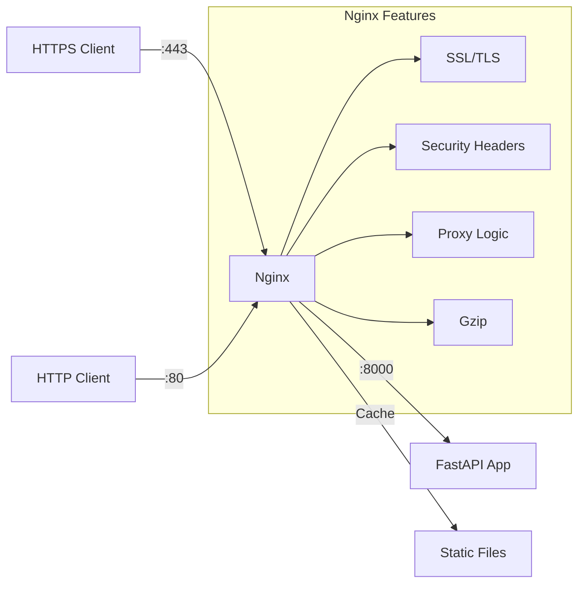

# Nginx Reverse Proxy Configuration

This directory contains the Nginx configuration for the demoSecureMCP, providing SSL/TLS termination, security headers, and reverse proxy functionality.

## Purpose

Nginx serves as the entry point for all HTTPS traffic, providing:
- **SSL/TLS Termination**: Handles HTTPS connections
- **Security Headers**: HSTS, CSP, X-Frame-Options, etc.
- **Reverse Proxy**: Routes requests to the FastAPI backend
- **Static Content**: Serves static files efficiently
- **Compression**: Gzip compression for responses
- **Rate Limiting**: Protection against abuse (optional)

## Architecture



## Configuration Files

### `nginx.conf`

Main Nginx configuration with:
- Global settings
- HTTP context configuration
- Include statements for site configs

Key features:
```nginx
# Performance tuning
worker_processes auto;
worker_connections 1024;

# Security
server_tokens off;
client_max_body_size 10M;

# Logging
access_log /var/log/nginx/access.log combined;
error_log /var/log/nginx/error.log warn;
```

### `conf.d/default.conf`

Site-specific configuration:

```nginx
# HTTP to HTTPS redirect
server {
    listen 80;
    server_name _;
    return 301 https://$server_name$request_uri;
}

# HTTPS server
server {
    listen 443 ssl http2;
    server_name localhost;
    
    # SSL configuration
    ssl_certificate /etc/nginx/ssl/cert.pem;
    ssl_certificate_key /etc/nginx/ssl/key.pem;
    ssl_protocols TLSv1.2 TLSv1.3;
    ssl_ciphers HIGH:!aNULL:!MD5;
    
    # Security headers
    add_header Strict-Transport-Security "max-age=31536000" always;
    add_header X-Frame-Options "DENY" always;
    add_header X-Content-Type-Options "nosniff" always;
    
    # Proxy to FastAPI
    location / {
        proxy_pass http://mcp-server:8000;
        proxy_set_header Host $http_host;
        proxy_set_header X-Real-IP $remote_addr;
        proxy_set_header X-Forwarded-For $proxy_add_x_forwarded_for;
        proxy_set_header X-Forwarded-Proto $scheme;
    }
}
```

## SSL/TLS Setup

### Development (Self-Signed)

The project includes self-signed certificates for development:
- `ssl/cert.pem` - Certificate
- `ssl/key.pem` - Private key

Generated via Docker entrypoint if missing.

### Production (Let's Encrypt)

For production, use Let's Encrypt with Certbot:

```bash
# Install certbot
apt-get install certbot python3-certbot-nginx

# Get certificate
certbot --nginx -d yourdomain.com

# Auto-renewal
certbot renew --dry-run
```

Or use Docker:
```yaml
certbot:
  image: certbot/certbot
  volumes:
    - ./certbot/conf:/etc/letsencrypt
    - ./certbot/www:/var/www/certbot
  entrypoint: "/bin/sh -c 'trap exit TERM; while :; do certbot renew; sleep 12h & wait $${!}; done;'"
```

## Security Headers

### Implemented Headers

1. **Strict-Transport-Security (HSTS)**
   ```
   max-age=31536000; includeSubDomains
   ```
   Forces HTTPS for 1 year

2. **X-Frame-Options**
   ```
   DENY
   ```
   Prevents clickjacking

3. **X-Content-Type-Options**
   ```
   nosniff
   ```
   Prevents MIME sniffing

4. **Content-Security-Policy**
   ```
   default-src 'self'; script-src 'self' 'unsafe-inline'
   ```
   Controls resource loading

5. **X-XSS-Protection**
   ```
   1; mode=block
   ```
   XSS filter (legacy browsers)

## Proxy Configuration

### Headers Forwarding

Important headers passed to backend:
- `X-Real-IP`: Client's real IP
- `X-Forwarded-For`: Full proxy chain
- `X-Forwarded-Proto`: Original protocol (http/https)
- `X-Forwarded-Host`: Original host

### WebSocket Support

For future WebSocket endpoints:
```nginx
location /ws {
    proxy_pass http://mcp-server:8000;
    proxy_http_version 1.1;
    proxy_set_header Upgrade $http_upgrade;
    proxy_set_header Connection "upgrade";
}
```

### Timeouts

```nginx
proxy_connect_timeout 60s;
proxy_send_timeout 60s;
proxy_read_timeout 60s;
```

## Performance Optimization

### Gzip Compression

```nginx
gzip on;
gzip_vary on;
gzip_min_length 1024;
gzip_types text/plain text/css text/xml text/javascript 
           application/javascript application/json;
```

### Static File Caching

```nginx
location /static/ {
    alias /usr/share/nginx/html/static/;
    expires 1y;
    add_header Cache-Control "public, immutable";
}
```

### Connection Limits

```nginx
limit_req_zone $binary_remote_addr zone=api:10m rate=10r/s;

location /api/ {
    limit_req zone=api burst=20 nodelay;
    proxy_pass http://mcp-server:8000;
}
```

## Logging

### Access Logs

Format includes:
- Client IP
- Request time
- Request method/path
- Response status
- Response size
- User agent
- Request duration

### Error Logs

Levels:
- `debug`: Very verbose
- `info`: Informational
- `notice`: Normal but significant
- `warn`: Warning conditions
- `error`: Error conditions
- `crit`: Critical issues
- `alert`: Immediate action required
- `emerg`: System unusable

### Log Rotation

Using Docker:
```yaml
logging:
  driver: "json-file"
  options:
    max-size: "10m"
    max-file: "3"
```

## Health Checks

### Nginx Health

```nginx
location /nginx-health {
    access_log off;
    return 200 "healthy\n";
    add_header Content-Type text/plain;
}
```

### Backend Health Proxy

```nginx
location /health {
    proxy_pass http://mcp-server:8000/health;
    access_log off;
}
```

## Custom Error Pages

```nginx
error_page 502 503 504 /50x.html;
location = /50x.html {
    root /usr/share/nginx/html;
}

error_page 404 /404.html;
location = /404.html {
    root /usr/share/nginx/html;
}
```

## Docker Integration

### Dockerfile

```dockerfile
FROM nginx:alpine
COPY nginx.conf /etc/nginx/nginx.conf
COPY conf.d/ /etc/nginx/conf.d/
COPY static/ /usr/share/nginx/html/static/
COPY docker-entrypoint.sh /
RUN chmod +x /docker-entrypoint.sh
ENTRYPOINT ["/docker-entrypoint.sh"]
```

### Environment Variables

Using `envsubst` for dynamic configuration:
```bash
# docker-entrypoint.sh
envsubst '$SERVER_NAME $BACKEND_URL' < /etc/nginx/conf.d/default.conf.template > /etc/nginx/conf.d/default.conf
```

## Monitoring

### Metrics

Key metrics to monitor:
- Request rate
- Response times
- Error rates (4xx, 5xx)
- Bandwidth usage
- Active connections

### Status Module

```nginx
location /nginx-status {
    stub_status on;
    access_log off;
    allow 127.0.0.1;
    deny all;
}
```

## Troubleshooting

### Common Issues

1. **502 Bad Gateway**
   - Backend not reachable
   - Check Docker networking
   - Verify backend health

2. **SSL Certificate Errors**
   - Certificate expired
   - Domain mismatch
   - Missing intermediate certs

3. **Large Request Errors**
   - Increase `client_max_body_size`
   - Check backend limits

### Debug Commands

```bash
# Test configuration
nginx -t

# Reload configuration
nginx -s reload

# View error logs
tail -f /var/log/nginx/error.log

# Test backend connectivity
curl http://mcp-server:8000/health
```

## Security Best Practices

1. **Keep Nginx Updated**
   ```bash
   docker pull nginx:alpine
   ```

2. **Restrict Methods**
   ```nginx
   if ($request_method !~ ^(GET|HEAD|POST|PUT|DELETE|OPTIONS)$) {
       return 405;
   }
   ```

3. **Hide Version**
   ```nginx
   server_tokens off;
   ```

4. **Rate Limiting**
   - Implement per-IP limits
   - Add burst handling
   - Log rate limit violations

5. **WAF Integration**
   - Consider ModSecurity
   - Or cloud WAF services

## Future Enhancements

1. **HTTP/3 Support**
   - QUIC protocol
   - Better performance

2. **Caching Layer**
   - Redis cache integration
   - Smart cache invalidation

3. **Geographic Restrictions**
   - GeoIP module
   - Country-based access

4. **A/B Testing**
   - Split traffic routing
   - Canary deployments 