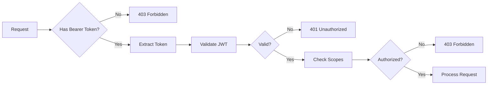

# FastAPI Application

This directory contains the main FastAPI application that serves the Secure MCP Server API.

## Structure

```
app/
├── __init__.py
├── main.py          # Application entry point
├── auth/            # Authentication & authorization
│   ├── dependencies.py   # Auth dependencies for routes
│   └── jwt_validator.py  # JWT token validation
├── tools/           # MCP tool implementations
│   ├── echo.py
│   ├── timestamp.py
│   ├── calculator.py
│   └── mcp_server.py
├── api/             # Additional API endpoints (future)
└── core/            # App-specific core components (future)
```

## Application Entry Point (`main.py`)

The main FastAPI application is defined here with:

### 1. **Lifespan Management**
```python
@asynccontextmanager
async def lifespan(app: FastAPI):
    # Startup
    await jwt_validator.initialize()  # Redis connection
    configure_logging()               # Logging setup
    validate_config()                 # Config validation
    yield
    # Shutdown
    await jwt_validator.close()       # Cleanup
```

### 2. **Middleware Stack** (Order matters!)
1. `CorrelationIDMiddleware` - Adds request tracking IDs
2. `SecurityContextMiddleware` - Extracts security context
3. `LoggingMiddleware` - Logs all requests/responses
4. `CORSMiddleware` - Handles CORS (built-in)

### 3. **Endpoint Organization**

#### Public Endpoints (No Auth Required)
- `GET /health` - Health check
- `GET /.well-known/oauth-protected-resource` - RFC 9728 metadata
- `GET /docs` - OpenAPI documentation
- `GET /redoc` - ReDoc documentation

#### Protected Endpoints (Auth Required)
- `GET /api/v1/me` - Current user info
- `GET /api/v1/protected/*` - Scope demonstration endpoints
- `GET /api/v1/tools` - List available MCP tools
- `POST /api/v1/tools/*` - Execute MCP tools

## Authentication Flow



## Dependency Injection

### Authentication Dependencies

1. **`get_current_user`**
   - Extracts and validates JWT token
   - Returns `TokenPayload` with user info
   - Logs authentication attempts

2. **Scope-Based Authorization**
   - `RequireMcpRead` - Requires `mcp:read` scope
   - `RequireMcpWrite` - Requires `mcp:write` scope
   - `RequireMcpInfer` - Requires `mcp:infer` scope
   - `RequireScope("custom")` - Custom scope requirement

### Usage Example
```python
@app.get("/protected")
async def protected_endpoint(
    current_user: Annotated[TokenPayload, RequireMcpRead],
    request: Request
):
    # User is authenticated and has mcp:read scope
    return {"user": current_user.sub}
```

## Security Features

### 1. **JWT Validation**
- Signature verification using JWKS
- Issuer validation
- Audience/AZP validation
- Expiration checking
- Algorithm whitelisting

### 2. **Scope Enforcement**
- Extracted from JWT `scope` claim
- Checked via dependencies
- Logged for audit trail

### 3. **Security Logging**
All security events are logged:
- Authentication attempts (success/failure)
- Authorization decisions
- Token validation errors
- Tool usage

### 4. **Request Context**
Security context available in `request.state`:
- `user_id`: Authenticated user ID
- `user_scopes`: List of user's scopes
- `correlation_id`: Request tracking ID
- `request_id`: Unique request ID
- `client_ip`: Client IP address

## Adding New Endpoints

### 1. **Basic Protected Endpoint**
```python
@app.get("/api/v1/my-endpoint")
async def my_endpoint(
    current_user: Annotated[TokenPayload, Depends(get_current_user)]
):
    return {"message": "Hello", "user": current_user.sub}
```

### 2. **Endpoint with Scope Requirement**
```python
@app.post("/api/v1/admin-action")
async def admin_action(
    current_user: Annotated[TokenPayload, RequireScope("admin")],
    request: Request
):
    logger.info(f"Admin action by {request.state.user_id}")
    return {"status": "success"}
```

### 3. **MCP Tool Endpoint**
```python
@app.post("/api/v1/tools/my-tool")
async def my_tool_endpoint(
    request: MyToolRequest,
    current_user: Annotated[TokenPayload, RequireMcpRead],
    req: Request
):
    # Create context for FastMCP
    ctx = create_tool_context(req)
    
    # Execute tool
    result = await my_tool(request, ctx)
    
    # Log tool usage
    log_tool_usage(req, "my-tool", current_user)
    
    return result.model_dump()
```

## Error Handling

### Standard Error Responses
- `401 Unauthorized` - Invalid/missing token
- `403 Forbidden` - Insufficient permissions
- `422 Unprocessable Entity` - Validation error
- `500 Internal Server Error` - Unexpected error

### Error Response Format
```json
{
    "detail": "Error message",
    "type": "error_type",
    "instance": "/api/v1/endpoint"
}
```

## Testing Endpoints

Use the test scripts or curl:

```bash
# Get token
TOKEN=$(curl -s -X POST http://localhost:8080/realms/mcp-realm/protocol/openid-connect/token \
  -d "grant_type=client_credentials" \
  -d "client_id=mcp-server" \
  -d "client_secret=your-secret" \
  -d "scope=mcp:read" | jq -r '.access_token')

# Test endpoint
curl -H "Authorization: Bearer $TOKEN" https://localhost/api/v1/me --insecure
```

## Performance Considerations

1. **Async Everything** - All I/O operations are async
2. **Connection Pooling** - Redis connections are pooled
3. **JWKS Caching** - Public keys cached with TTL
4. **Minimal Middleware** - Only essential middleware
5. **Efficient Logging** - Structured logs, async handlers

## Future Enhancements

- Rate limiting per user/client
- Request/response caching
- WebSocket support for real-time tools
- GraphQL endpoint option
- API versioning strategy 