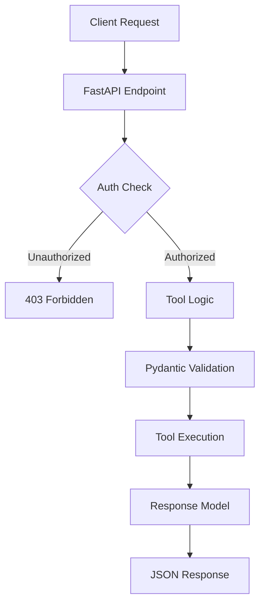

# MCP Tools

This directory contains Model Context Protocol (MCP) tool implementations that provide secure, authenticated access to various functionalities.

## Structure

```
tools/
├── __init__.py
├── echo.py          # Echo tool - message transformation
├── timestamp.py     # Timestamp tool - time utilities
├── calculator.py    # Calculator tool - math operations
└── mcp_server.py    # FastMCP server configuration
```

## What are MCP Tools?

MCP (Model Context Protocol) tools are functions that AI models can call to:
- Access external data sources
- Perform computations
- Interact with APIs
- Execute business logic

In this secure implementation, all tools require proper authentication and authorization.

## Tool Architecture



## Creating a New Tool

### 1. Define Models

```python
# src/app/tools/weather.py
from pydantic import BaseModel, Field
from typing import Optional, List
from datetime import datetime

class WeatherRequest(BaseModel):
    """Request model for weather tool"""
    location: str = Field(..., description="City name or coordinates")
    units: Optional[str] = Field("metric", description="Temperature units: metric/imperial")
    forecast_days: Optional[int] = Field(0, ge=0, le=7, description="Days of forecast")

class WeatherResponse(BaseModel):
    """Response model for weather tool"""
    location: str
    temperature: float
    conditions: str
    humidity: int
    timestamp: datetime
    forecast: Optional[List[dict]] = None
```

### 2. Implement Tool Logic

```python
from fastmcp import Context
from src.core.logging import get_logger

logger = get_logger(__name__)

async def weather_tool(request: WeatherRequest, ctx: Context) -> WeatherResponse:
    """
    Get weather information for a location.
    
    This tool demonstrates:
    - External API integration
    - Error handling
    - Context logging
    - Response formatting
    """
    await ctx.info(f"Fetching weather for {request.location}")
    
    try:
        # Call external weather API
        weather_data = await fetch_weather_api(
            location=request.location,
            units=request.units
        )
        
        # Process response
        response = WeatherResponse(
            location=request.location,
            temperature=weather_data["temp"],
            conditions=weather_data["description"],
            humidity=weather_data["humidity"],
            timestamp=datetime.utcnow()
        )
        
        # Add forecast if requested
        if request.forecast_days > 0:
            response.forecast = await fetch_forecast(
                location=request.location,
                days=request.forecast_days
            )
        
        await ctx.info("Weather data retrieved successfully")
        return response
        
    except ExternalAPIError as e:
        await ctx.error(f"Weather API error: {str(e)}")
        raise ValueError(f"Unable to fetch weather: {str(e)}")
```

### 3. Register FastAPI Endpoint

In `src/app/main.py`:

```python
from src.app.tools.weather import WeatherRequest, WeatherResponse, weather_tool

@app.post(
    "/api/v1/tools/weather",
    response_model=Dict[str, Any],
    tags=["MCP Tools"]
)
async def weather_endpoint(
    request: WeatherRequest,
    current_user: Annotated[TokenPayload, RequireMcpRead],
    req: Request
):
    """
    Weather tool - get current weather and forecast.
    
    Requires mcp:read scope.
    """
    # Create context for tool
    class MockContext:
        async def info(self, msg: str): 
            logger.info(msg, user_id=req.state.user_id)
        async def debug(self, msg: str): 
            logger.debug(msg)
        async def warning(self, msg: str): 
            logger.warning(msg)
        async def error(self, msg: str): 
            logger.error(msg)
    
    ctx = MockContext()
    
    try:
        response = await weather_tool(request, ctx)
        
        # Log tool usage
        security_logger.log_tool_usage(
            user_id=req.state.user_id,
            tool_name="weather",
            client_ip=req.state.client_ip,
            parameters=request.model_dump()
        )
        
        return response.model_dump()
        
    except ValueError as e:
        raise HTTPException(
            status_code=status.HTTP_400_BAD_REQUEST,
            detail=str(e)
        )
    except Exception as e:
        logger.error(f"Weather tool error: {str(e)}")
        raise HTTPException(
            status_code=status.HTTP_500_INTERNAL_SERVER_ERROR,
            detail="Weather service unavailable"
        )
```

### 4. Update Tool Discovery

Add to the tools list in `list_tools` endpoint:

```python
{
    "name": "weather",
    "description": "Get weather information and forecasts",
    "endpoint": "/api/v1/tools/weather",
    "required_scope": "mcp:read",
    "available": "mcp:read" in user_scopes,
    "parameters": {
        "location": "string (required) - City or coordinates",
        "units": "string (optional) - metric/imperial",
        "forecast_days": "integer (optional) - Days of forecast (0-7)"
    }
}
```

### 5. Add Tests

```python
# tests/test_weather_tool.py
async def test_weather_tool():
    token = get_test_token(scope="mcp:read")
    
    response = await client.post(
        "/api/v1/tools/weather",
        headers={"Authorization": f"Bearer {token}"},
        json={
            "location": "London",
            "units": "metric",
            "forecast_days": 3
        }
    )
    
    assert response.status_code == 200
    data = response.json()
    assert data["location"] == "London"
    assert "temperature" in data
    assert len(data.get("forecast", [])) == 3
```

## Existing Tools

### Echo Tool (`echo.py`)
- **Purpose**: Demonstrates basic tool structure
- **Scope**: `mcp:read`
- **Features**:
  - Message transformation (uppercase)
  - Optional timestamp
  - Metadata in response

### Timestamp Tool (`timestamp.py`)
- **Purpose**: Time and date utilities
- **Scope**: `mcp:read`
- **Features**:
  - Custom format strings
  - Timezone support
  - Epoch timestamps
  - Relative time calculations

### Calculator Tool (`calculator.py`)
- **Purpose**: Mathematical operations
- **Scope**: `mcp:write` (demonstrates write scope)
- **Features**:
  - Basic operations (add, subtract, multiply, divide)
  - Advanced operations (power, sqrt, factorial)
  - Error handling (division by zero, etc.)
  - Precision control

## Tool Security

### Authentication
All tools require valid JWT tokens with appropriate scopes:
- Read operations: `mcp:read`
- Write operations: `mcp:write`
- AI inference: `mcp:infer`

### Authorization
Tools check scopes via FastAPI dependencies:
```python
current_user: Annotated[TokenPayload, RequireMcpRead]
```

### Audit Logging
All tool usage is logged with:
- User ID
- Tool name
- Parameters
- Timestamp
- Client IP
- Success/failure status

### Input Validation
Pydantic models validate all inputs:
- Type checking
- Range validation
- Required fields
- Custom validators

## Best Practices

1. **Model Design**
   - Use descriptive field names
   - Add comprehensive descriptions
   - Set sensible defaults
   - Use appropriate constraints

2. **Error Handling**
   - Catch specific exceptions
   - Provide helpful error messages
   - Log errors appropriately
   - Don't leak sensitive info

3. **Performance**
   - Use async/await properly
   - Cache when appropriate
   - Set reasonable timeouts
   - Monitor execution time

4. **Documentation**
   - Add docstrings to all functions
   - Document parameters clearly
   - Include usage examples
   - Explain error conditions

## Testing Tools

### Manual Testing
```bash
# Get token
TOKEN=$(curl -s -X POST http://localhost:8080/realms/mcp-realm/protocol/openid-connect/token \
  -d "grant_type=client_credentials" \
  -d "client_id=mcp-server" \
  -d "client_secret=your-secret" \
  -d "scope=mcp:read mcp:write" | jq -r '.access_token')

# Test echo tool
curl -X POST https://localhost/api/v1/tools/echo \
  -H "Authorization: Bearer $TOKEN" \
  -H "Content-Type: application/json" \
  -d '{"message": "Hello, MCP!", "uppercase": true}' \
  --insecure | jq

# Test calculator
curl -X POST https://localhost/api/v1/tools/calculate \
  -H "Authorization: Bearer $TOKEN" \
  -H "Content-Type: application/json" \
  -d '{"operation": "multiply", "operands": [7, 6]}' \
  --insecure | jq
```

### Integration with AI Models
Tools are designed to be called by AI models that understand MCP protocol:
1. Model discovers available tools via `/api/v1/tools`
2. Model constructs appropriate request
3. Server validates and executes tool
4. Model processes response

## Future Enhancements

- **Tool Permissions**: Fine-grained permissions per tool
- **Rate Limiting**: Per-tool rate limits
- **Caching**: Response caching for expensive operations
- **Streaming**: Support for streaming responses
- **Batch Operations**: Multiple tool calls in one request
- **Tool Versioning**: Support multiple versions of tools
- **Custom Scopes**: Tool-specific scope requirements 